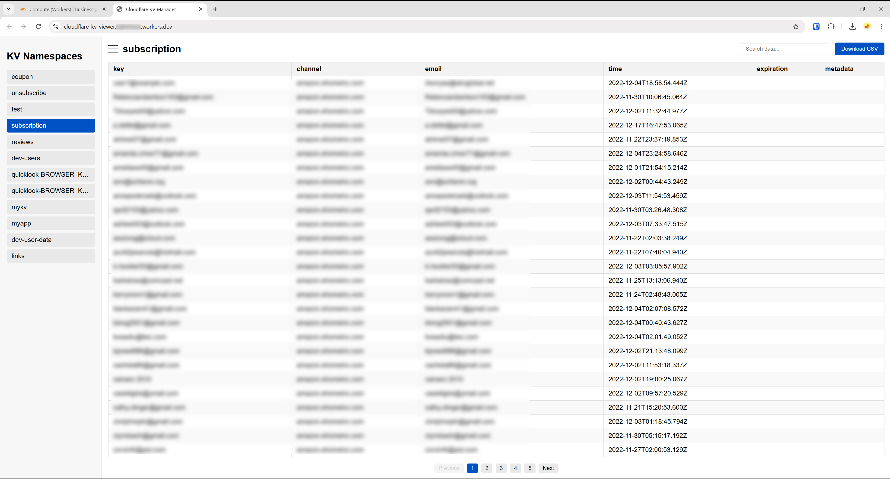

# Cloudflare KV Manager

A Cloudflare Worker-based application for managing and exploring your Cloudflare KV namespaces.



## Features

- 📋 Browse all KV namespaces in your Cloudflare account
- 🔍 Search through KV data with real-time filtering
- 📊 Intelligent display of JSON data in tabular format
- 📱 Responsive design with collapsible sidebar
- 📄 Export data to CSV with one click
- 📑 Pagination for large datasets (30 rows per page)
- 🔄 Expandable JSON objects for nested data exploration

## Installation

1. **Clone this repository or copy the Worker code:**

```bash
git clone https://github.com/Xbeninni/Cloudflare-KV-Viewer.git
```

2. **Deploy to Cloudflare Workers:**

```bash
# Install Wrangler CLI if you haven't already
npm install -g wrangler

# Authenticate with your Cloudflare account
wrangler login

# Create a new worker
wrangler init cloudflare-kv-manager

# Replace the generated index.js with the Worker code
# Then deploy
wrangler publish
```

3. **Set up environment variables:**

In your `wrangler.jsonc` file or via the Cloudflare Dashboard, add these environment variables:

```json
"vars": {
    "CLOUDFLARE_API_TOKEN": "your-api-token",
    "CLOUDFLARE_ACCOUNT_ID": "your-account-id"
}
```

## API Token Permissions

The API token used for this application needs the following permissions:

- **Account** > **Workers KV Storage** > **Read**
- **Account** > **Workers KV Storage** > **Edit**

You can create a new API token in the Cloudflare Dashboard under **My Profile** > **API Tokens**.

## Usage

### Browsing KV Namespaces

1. Open the application in your browser
2. The left sidebar displays all available KV namespaces
3. Click on a namespace to view its data

### Working with Data

- **Pagination**: Navigate through large datasets using the pagination controls at the bottom
- **Search**: Use the search box in the top right to filter data
- **Download**: Click the "Download CSV" button to export all data (or filtered data)
- **Expand JSON**: Click on cells with `{ ... }` to expand nested JSON objects

### Mobile Usage

- The sidebar automatically collapses on small screens
- Use the hamburger menu (☰) to toggle the sidebar
- The UI is fully responsive and works on phones and tablets

## Technical Details

### Architecture

This application is entirely self-contained in a single Cloudflare Worker script. It uses:

- Vanilla JavaScript for all functionality
- CSS for styling (no external frameworks)
- Cloudflare's KV API for data access

### Data Flow

1. Worker serves the HTML/CSS/JS application
2. Client-side JavaScript fetches KV namespaces from the Worker's API endpoint
3. When a namespace is selected, data is fetched from another API endpoint
4. All filtering, pagination, and CSV generation happens client-side for optimal performance

### API Endpoints

The Worker exposes these API endpoints:

- `GET /api/list-namespaces` - Returns a list of all KV namespaces
- `GET /api/kv-data/:namespaceId` - Returns all key-value pairs in the specified namespace

## Customization

### Styling

You can customize the appearance by modifying the CSS in the HTML template within the Worker code.

### Pagination

To change the number of items per page, modify the `itemsPerPage` constant in the JavaScript.

```javascript
const itemsPerPage = 30; // Change this to your desired number
```

### CSV Format

The CSV export includes all columns from the data. If your KV values contain JSON, the CSV will have columns for each top-level JSON property.

## Troubleshooting

### Common Issues

1. **"Failed to list KV namespaces" error**
   - Check that your API token has the correct permissions
   - Verify your account ID is correct

2. **No namespaces shown**
   - Ensure your account has at least one KV namespace created
   - Check browser console for errors

3. **Cannot see data in a namespace**
   - The namespace might be empty
   - Your API token might not have access to this specific namespace

### Browser Support

This application works in all modern browsers including:
- Chrome/Edge (latest)
- Firefox (latest)
- Safari (latest)
- Mobile browsers (iOS/Android)

## Security Considerations

- The application requires an API token with read access to your KV namespaces
- All data processing happens client-side; no data is stored on the server
- The worker itself should be restricted to authorized users via Cloudflare Access or similar

## Contributing

Contributions are welcome! Please feel free to submit a Pull Request.

## License

This project is licensed under the MIT License - see the LICENSE file for details.

## Acknowledgments

- Built with Cloudflare Workers
- Inspired by the need for a simple KV management interface
